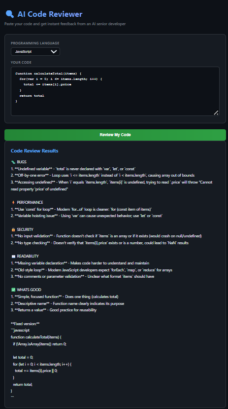

# 🔍 AI Code Reviewer

An AI-powered code review tool built with Claude API. Paste your code, get instant structured feedback on bugs, security issues, and improvements — in seconds.

## 🚀 What It Does

Developers spend hours on manual code reviews. This tool uses Claude AI to instantly analyse your code and return structured feedback — so you can focus on building, not reviewing.

**You paste code → Claude analyses it → You get a structured review in under 5 seconds.**

---

## ✨ Features

- **Bug Detection** — Identifies logic errors, null pointer risks, and common pitfalls
- **Security Analysis** — Flags injection vulnerabilities, exposed secrets, and unsafe patterns
- **Code Quality** — Suggests improvements for readability, naming, and structure
- **Best Practices** — Checks against language-specific conventions
- **Multi-language Support** — Works with JavaScript, Java, Python, TypeScript, and more

---

## 🏗️ How It Works

1. User pastes code into the web interface
2. Frontend sends code to Express backend via POST /api/review
3. Backend constructs a structured prompt and sends to Claude API
4. Claude analyses the code and returns categorised feedback
5. Frontend renders issues organised by category

---

## 🛠️ Tech Stack

| Layer | Technology |
|---|---|
| Backend | Node.js + Express |
| AI | Anthropic Claude API |
| Frontend | HTML, CSS, Vanilla JS |
| API Style | REST |

---

## ⚙️ Getting Started

### Prerequisites
- Node.js v18+
- Anthropic API key — get one at [console.anthropic.com](https://console.anthropic.com)

### Installation

Clone the repository and install dependencies:

    git clone https://github.com/manasa-shivananda/ai-code-reviewer.git
    cd ai-code-reviewer
    npm install

### Configuration

Create a .env file and add your API key:

    ANTHROPIC_API_KEY=your_api_key_here
    PORT=3000

### Run

    node src/index.js

Open http://localhost:3000 in your browser.

---

## 📸 Demo

---

## 🧠 What I Learned

- **Claude API integration** — prompt engineering for structured, consistent output
- **System prompt design** — crafting prompts that return reliable, parseable responses
- **REST API design** — clean separation between AI logic and server layer
- **Error handling for AI responses** — managing token limits, timeouts, and malformed outputs

---

## 🗺️ Roadmap

- [ ] Structured JSON output with line-level issue mapping
- [ ] Support for file upload (.js, .java, .py)
- [ ] Side-by-side diff view with suggested fixes
- [ ] GitHub PR integration via webhook

---

## 👩‍💻 About

Built by [Manasa Shivananda](https://github.com/manasa-shivananda) — Full-Stack Developer specialising in AI-powered tooling.

**AI Portfolio Series:**
- ✅ Project 1: AI Code Reviewer (this project)
- 🔄 Project 2: AI Document Q&A Tool — in progress

---

## 📄 License

MIT License
